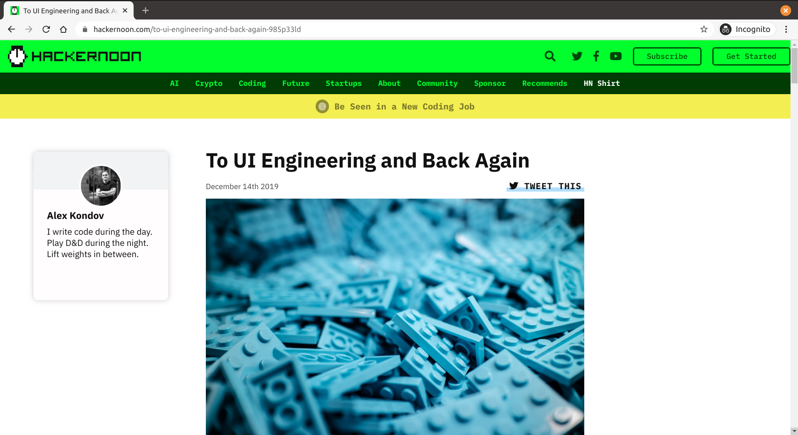
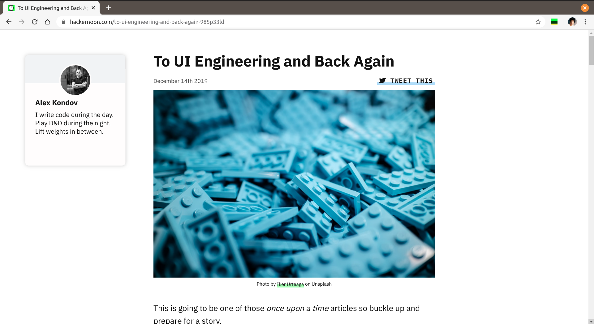

# Readable Hackernoon

Readable Hackernoon is a [Chrome extension](https://chrome.google.com/webstore/detail/bbaopcbihfmndeedafhcafpojpibkgic) to remove the big colorful fixed header of the story on Hackernoon for more readable space.

### Preview

_Before_
<kbd></kbd>

_After Readable Hackernoon_
<kbd></kbd>

### License

MIT
